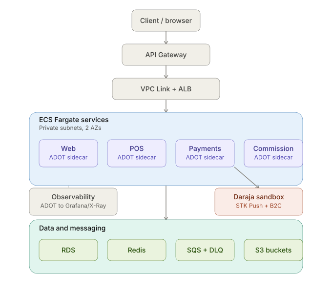

# Architecture — TillFlow (Group 2)

## System overview

TillFlow is a multi-tenant SaaS POS system that records sales, takes payment via
M-Pesa (Daraja STK Push), and pays register attendants their daily commission via
M-Pesa B2C. The system must stay correct when Daraja requests time out, callbacks
repeat, or infrastructure fails.

## Required architecture

WEB -> API GATEWAY -> SERVICES -> STATE + EDGES
(ECS Fargate) (VPC Link + ALB) POS | Payments | Commission
RDS | Redis | S3 | SQS | Daraja

- **Entry point:** API Gateway -> VPC Link -> Application Load Balancer (ALB)
- **Compute:** Separate ECS Fargate services, one per backend area (`pos`,
  `payments`, `commission`, `web`), each running in private subnets across two
  Availability Zones
- **Sidecar:** Every backend task runs the application container plus an ADOT
  Collector sidecar, exporting OTLP to CloudWatch/Prometheus and X-Ray to Grafana
- **Data:** RDS PostgreSQL (service-owned schemas and least-privilege roles),
  Redis/Valkey (ElastiCache, cache-aside), SQS plus DLQ for async work,
  EventBridge for the daily commission schedule
- **Storage:** S3 buckets for Terraform state (with DynamoDB lock), pipeline
  artifacts, ALB access logs, backups/exports, and evidence

## Service boundaries

| Service    | Responsibility |
|------------|----------------|
| Web        | Frontend / API shell, tenant-facing UI |
| POS        | Tenant setup, sale recording (integer minor units), idempotent sale creation |
| Payments   | Daraja auth, STK Push, callbacks, transaction query, B2C, reconciliation |
| Commission | Daily close: calculates payouts from confirmed paid sales only, writes payout ledger, requests B2C through the Payments API (never directly) |

## Key invariants

- A payment timeout is not a decline — it stays pending until reconciled
- Commission never calls Daraja directly; it always goes through the Payments API
- Replay of a callback or a commission run must never double-charge or double-pay

## Diagram

## Region

See `docs/adr/0001-aws-region.md` for the region decision and rationale.
